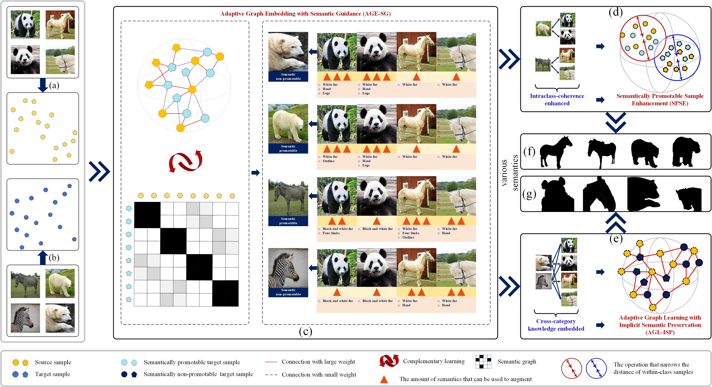

# Adaptive Graph Learning with Semantic Promotability for Domain Adaptation

This repository contains the codes of Adaptive Graph Learning with Semantic Promotability for Domain Adaptation, which is accepted by *IEEE Transactions on Pattern Analysis and Machine Intelligence (TPAMI)* and the paper can be accessed [here](https://ieeexplore.ieee.org/document/10769571).



**Abstract**: Domain Adaptation (DA) is used to reduce cross-domain differences between the labeled source and unlabeled target domains. As the existing semantic-based DA approaches mainly focus on extracting consistent knowledge under semantic guidance, they may fail in acquiring (a) personalized knowledge between intra-class samples, and (b) local knowledge of neighbor samples from different categories. Hence, a multi-semantic-granularity and target-sample oriented approach, called Adaptive Graph Learning with Semantic Promotability (AGLSP), is proposed, which consists of three parts: (a) Adaptive Graph Embedding with Semantic Guidance (AGE-SG) that adaptively estimates the promotability of target samples and learns variant semantic and geometrical components from the source and those semantically promotable target samples; (b) Semantically Promotable Sample Enhancement (SPSE) that further increases the discriminability and adaptability of tag granularity by mining the features of intra-class source and semantically promotable target samples with multi-granularities; and (c) Adaptive Graph Learning with Implicit Semantic Preservation (AGL-ISP) that forms the tag granularity by extracting commonalities between the source and those semantically non-promotable target samples. As AGLSP learns more semantics from the two domains, more cross-domain knowledge is transferred. Mathematical proofs and extensive experiments on seven datasets demonstrate the performance of AGLSP.

## Code files (matlab implementation)

├─demo.m: experimental demonstration on Office (surf) dataset.  
├─AGLSP.m: the implementation of AGLSP.   
├─solveAGE_SG_and_AGL_ISP.m: the implementation of AGE-SG and AGL-ISP.  
├─visualization experiments: Some codes to conduct visualization experiments.  
└─utils: Some auxiliary functions.  
      └─liblinear: A libsvm tool.   

## Example usage

- Use ```addpath(genpath('./utils/'))``` to add the required auxiliary functions, after which you can use ``` AGLSP(Xs,Ys,Xt,Yt,options)```to call AGLSP wherever you need to.

- You can launch the program by executing "demo.m" in the root directory (in windows), or use the following command to run it in Linux (The output will be stored in "fill.out"). The codes will be run directly without errors.

```python
nohup matlab <demo.m> fill.out &
```

## Citation

> Z. Zheng, S. Teng, L. Teng, W. Zhang and N. Wu, "Adaptive Graph Learning with Semantic Promotability for Domain Adaptation," in *IEEE Transactions on Pattern Analysis and Machine Intelligence*, doi: 10.1109/TPAMI.2024.3507534.
